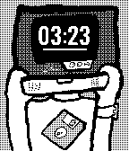

# LaptopmanFace
A watch face for Pebble watches starring my signature "Laptopman" avatar. Disconnecting the watch from your phone replaces your laptop pal with his evil twin. It's fairly simple, but it's still really neat.

**Note:** This app was written in C, a language that I am not super familiar with. As a result, the code might not be as elegant as it could be, but I'm working on it!

## Screenshots

## Supported Devices
- As of v1.4, all of the (released) Pebbles!

## Check It Out!
Want to try it out? If so, you can get the PBW from the [releases page](https://github.com/johnspahr/laptopmanface/releases) or from [Rebble](https://apps.rebble.io/en_US/application/626b1ef27ca61400094ed7e4).

Also be sure to check out [Compliment Moi for Pebble](https://github.com/johnspahr/compliment-moi-pebble).
